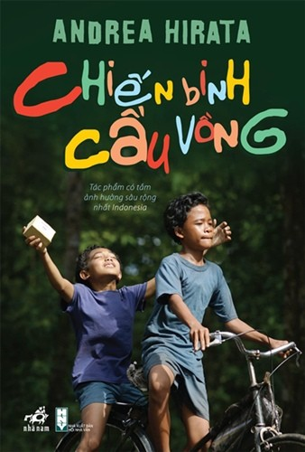

---
title: Chiến binh cầu vồng - Andrea Hirata
catalog: true
categories:
  - Review sách
date: 2017-10-09 23:30
author: Khoai
header-img: ../media/chien-binh-cau-vong.jpg
---

Một câu chuyện dựa trên những trải nghiệm chân thực thời thơ ấu của chính nhà văn người Indonesia - Andrea Hirata. Một cuốn sách mà tôi cảm thấy giá trị nhất mà tôi có.

Cuốn sách nhỏ bé chứa đựng nghị lực phi thường của 10 đửa trẻ nghèo đói nhưng vô cùng mạnh mẽ, của một người cha làm nghê đánh cá cơ cực nhưng quyết tâm cho con trai đi học, của một người thầy già cả một đời tận tùy với nghề giáo tại một ngôi trường làng xập xệ cho đến tận khi cái chết chia lìa, của một cô giáo trẻ mỏng manh nhưng có sức mạnh to lớn của tình yêu, can trường đối mặt với tất cả những khó khăn để duy trì tiếp nối quyết tâm đến trường của những đứa học trò nhỏ - nửa linh hồn của mình. Tất cả những mảnh ghép không hoàn hảo ấy của cuộc đời, họ cùng nhau tạo nên một kiệt tác.

Nếu nói về nội dung của truyện ắt hẳn sẽ dài hơi bởi khó mà bỏ đi chi tiết nào ở đó. Mỗi một số phận, mỗi một nhân vật đều mang đến những rung cảm mạnh mẽ. Tôi đã cùng cười, cùng khóc và cùng trăn trở. 10 đứa trẻ sống trong màn đêm nghèo khó, khi mà đến cái sự nghèo nó lay lắt đến héo tàn, khi mà những rào cản của cái nghèo luôn đeo bám, nhưng những tài năng nhỏ ấy đều mang trong mình ánh sáng của hy vọng, của những ước mơ cháy rực, những hoài bão về tương lai. Chưa bao giờ, tôi cảm thấy những ước mơ đặc biệt đến thế, bởi đơn giản nó thực sự hồn nhiên và đầy niềm đam mê, chúng dám và sẵn sàng thực hiện nó.

Thế nhưng, đau lòng thay, hiện thực ác nghiệt vẫn luôn xoay vần, và rằng có những ước mơ chưa đến được đích. Nếu như một Trapani đẹp trai, phong độ với ước mơ được làm thầy giáo cuối cùng lại bị hiện thực ấy vùi dập, trở thành một bệnh nhân tâm thần - một tàn dư của xã hội. Mahar, một thiên tài với những sáng tạo và cảm thụ nghệ thuật vô cùng độc đáo cuối cùng lại đi theo con đường sùng bái tôn giáo mù quáng.

Và điều khiến tôi xót xa nhất chính là một Lintang một cậu nhóc làng chài sống trong gia đình 14 người, vẫn luôn cố gắng đến trường mỗi ngày, một thần đồng sáng dạ nhất, luôn mạnh mẽ và chiến đầu bền bỉ nhất, thủ lĩnh của đội Chiến binh cầu vồng đã từng nói "đừng bao giờ bỏ cuộc", "chúng ta phải biết ước mơ" đến cuối cùng đã phải từ bỏ ước mơ của chính mình, phải nghỉ học nuôi gia đình sau khi ba cậu mất, gạt hoài bão của mình đi vì miếng cơm manh áo - "Chúng tôi đã khuỵu xuống vì một kẻ thù vô hình, mạnh nhất, độc ác nhất, vô nhân tính nhất và khó chống lại nhất. Như một khối u ác tính nó gặm dần những học sinh, những thầy cô giáo và ngay cả chính hệ thống giáo dục. Kẻ thù đó là chủ nghĩa thực dụng."

Có hay chăng “Cuộc sống là những gì xảy đến với bạn trong khi bạn đang lập những kế hoạch này nọ.” Có hay chăng cuộc sống luôn chứa đựng nhiều điều bất ngờ, mọi việc đôi khi không đúng kế hoạch, không như mong đợi, không lường trước được… Nhưng đến cuối cùng, câu chuyện vẫn mang đến một niềm tin dai dẳng, "những thứ đã không thể khiến bạn chùn bước thì nhất định sẽ làm bạn mạnh mẽ hơn." Ở đó luôn có những trái tim không bao giờ bỏ cuộc và sẽ không bao giờ dừng lại.

Hãy mạnh mẽ đối diện với mọi việc, dù cho những kế hoạch A, B, C… của bạn đều bị vỡ lở, và cái cách bạn phản ứng với nó chính như cách mà cuộc sống đang tiếp diễn vậy. Bạn có thể lựa chọn phản ứng theo cảm xúc, trực giác hoặc nhìn nhận vấn đề theo một góc độ mà bạn cho là tốt hơn. Bởi thái độ và cách bạn đối mặt với những khó khăn trong cuộc sống, đôi khi còn quan trọng hơn cả việc tìm ra giải pháp.

Hà Nội, một ngày đầy nắng!