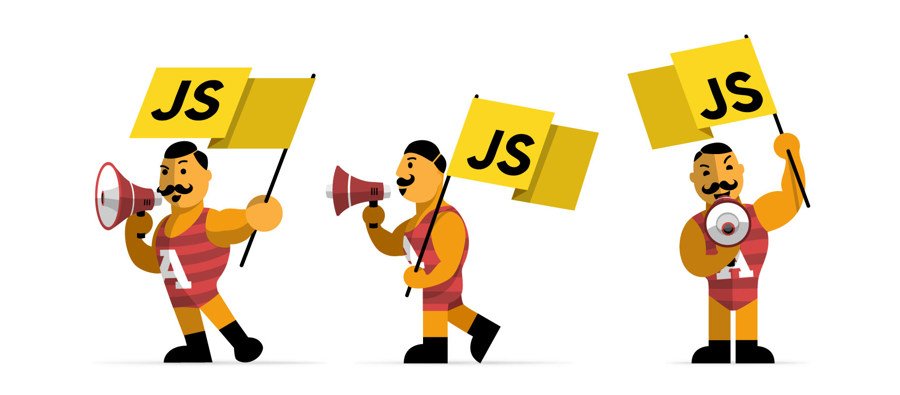

### Js à, you can't "bối rối" me anymore!

<!--more-->

**Hello!**
Chào mừng các bạn đến với chuyên mục mới của mình. Lâu rồi không viết lách cảm thấy cuồng tay quá :))

Thời gian gần đây, **Javascript** bá đạo quá đúng ko.

Đủ loại platform, framework, libs xây dựng bằng ngôn ngữ này.

**Javascript** xuất hiện trong những nền tảng client side và server side, một số nổi nhất có thể kể đến là **Nodejs, Angular/ Ionic, React/ React native, Meteor, Electron**. Xu hướng _"Write once, build everywhere"_ và _"Javascript for everywhere"_ có lẽ sẽ không dừng lại, ít nhất trong vài năm nữa. (khẳng định)

Javascript thuần tính đến thời điểm trước 2015 vẫn còn khá "_si đa_", vì thế có vô số thể loại sinh ra nhằm cải tiến ngôn ngữ này. Chuẩn có **EcmaScript**, ngôn ngữ mở rộng có **TypesCript, CoffeeScript**, linter có **ESlint, JSlint**, compiler có **Babel** ... Những thứ muốn hiểu và master hết chắc phải mất ... cả đời mất (crwl).

## Javascript rất được các dev nuông chiều và cưng nựng

Giống như một cô gái, **Javascript** liên tục thay đổi, và khó đoán. Vì thế cập nhật kiến thức thường xuyên là việc cần thiết.
Những bài viết trong serie này được mình đúc kết trong quá trình dev **Javascript** nên sẽ không có một menu cố định, mỗi khi khám phá được một tính năng nào đó hay ho thì sẽ cập nhật thêm.

Cùng theo dõi và góp ý nếu bạn cảm thấy có điều gì đó hay ho nhé :D

p/s: Để thấy được thế giới Javascript rộng lớn thế nào, thử đọc bài viết này xem
Tiếng Việt: [Link](https://kipalog.com/posts/Cam-thay-the-nao-khi-hoc-Javascript-trong-nam-2016)
Tiếng Anh: [Link](https://hackernoon.com/how-it-feels-to-learn-javascript-in-2016-d3a717dd577f)

## Các bài viết (sẽ được cập nhật thêm)

1.  Promise, hứa thật nhiều, thất hứa cũng thật nhiều
2.  Prototype, Javascript kiểu mẫu
3.  Call, bind, apply, các thứ các thứ