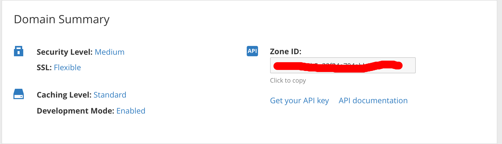

## Vấn đề

Chả là dạo này đang ngồi làm mấy pờ rồ giếc cần yêu cầu **HTTPS** nên nghĩ ngay đến thằng Cloudflare để dùng tính năng SSL của nó (bật chế độ Flexiable) (chú thích: mình không nhận tiền PR cho nó đâu nhá).<!--more-->

Ok! App chạy mượt mà và **hỗ trợ SSL**. Nhưng ôi sự thật lại éo le :)) Mình đang phát triển app đó nên app thay đổi liên tục và thằng Cloudflare nó vô duyên cache hết resource của mình thế là mấy ông Dev cứ kêu: "Code tao úp lên sao méo chạy."

May quá thằng Cloudflare lại có tính năng **Develoment Mode để tắt cache** của nó đi trong khi mình đang dev app nhưng mà sau **3 tiếng** nó tự động tắt đi nên mình lại phải bật lại nên cũng thấy hơi nhầy :))

## Giải pháp

Trong tình huống đó có 2 trường hợp có thể giải quyết.

Một là, phải cài SSL ở server của mình rồi tắt thằng Cloudflare đi, nhưng bệnh lười của mình lại tái phát, ngại cài đặt này nọ, config con phiếc mệt người bỏ mẹ mà mình lại quý mẹ nên bỏ qua phương án này.

Hai là, nghĩ xem có cách nào để Development Mode của site luôn _on_, cách này có vẻ dễ. Một tia chớp lóe trong đầu vì lướt qua thấy Cloudflare có API của nó cộng thêm với **crontab** trên server nữa thì tuyệt cmn vời :)) Sự sống như trở lại :))

## Thực thi

Mò ra thì thấy cái **API** để xử lý:

<pre>https://api.cloudflare.com/#zone-settings-change-development-mode-setting</pre>

Nó còn viết luôn cái ví dụ Curl cho mình (yêu quá cơ):

<pre>
curl -X PATCH "https://api.cloudflare.com/client/v4/zones/023e105f4ecef8ad9ca31a8372d0c353/settings/development_mode" \
     -H "X-Auth-Email: user@example.com" \
     -H "X-Auth-Key: c2547eb745079dac9320b638f5e225cf483cc5cfdda41" \
     -H "Content-Type: application/json" \
     --data '{"value":"on"}'
</pre>

**023e105f4ecef8ad9ca31a8372d0c353** -> Zone ID
**c2547eb745079dac9320b638f5e225cf483cc5cfdda41** -> API Key
**user@example.com** -> Email quản lý site đó.

Xong bây giờ mình chỉ cần lấy cái **Zone ID** của site và lấy cái **API Key** kia nữa là xong.

Bạn có thế thấy ngay ở trong phần Overview của site.

Ok. Sau đó mình nhét đoạn lệnh curl kia và 1 file tạm đặt là `dev.sh`

Cuối cùng mình thêm 1 cronjob vào server (chạy lệnh `crontab -e` để edit).
Mình lên **crontab.guru** để xem cách viết crontab và viết thành:

<pre>
0 */3 * * * sh /path_to_directory/dev.sh
</pre>

Đoạn crontab này có nghĩa là sau 3 tiếng mình lại chạy file sh kia để bật lại tính năng **Development Mode**.Vậy là coi như lúc nào app của mình cũng trong trạng thái đang dev và khi nào mình release app thì chỉ cần bỏ crontab đó đi là được :))

## Kết luận

Bài học của chúng ta rút ra ở đây là gì nào? À méo có bài học gì đâu :)) Thực tế thì đây cũng không phải là giải pháp hay nhưng đối với mình thì nó phù hợp còn đối với các trường hợp khác thì chưa chắc đâu nhé!

#29tetngoitrongbanhchung