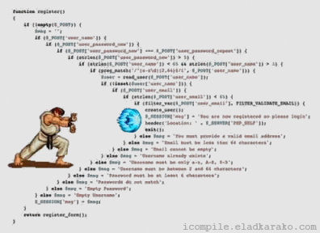

Như thiên hạ nói, **Node.js** là 1 nền tảng dựng trên trình biên dịch Javacript [Google Chrome V8](https://developers.google.com/v8) của thằng Google - hàng hịn đừng hỏi. Trình biên dịch này rất nhanh trên trình duyệt nên người ta nghĩ cách đưa nó vào **server side**. Thế là Node.js ra đời.

Mới đầu nghe đến Node.js chạy không đồng bộ hay bọn mẽo gọi là **non-blocking** nghe có vẻ rất nguy hiểm nhưng thực tế thì cũng bình thường thôi :))<!--more-->

### Chạy không đồng bộ

Nếu bạn có biết đến **PHP** bạn sẽ dễ dàng hiểu ví dụ này:

Dễ thấy các việc xảy ra **phải tuần tự** từ trên xuống dưới.

Nhưng đối với Node.js thì khác: (Event every where)

Lúc này ta như có thuật phân thân làm rất nhiều việc cùng lúc. Mỗi việc mà phải chờ đợi nó sẽ tạo ra 1 sự kiện, sự kiện đó xảy ra hàm callback sẽ được chạy. Như trong ví dụ trong khi bạn chờ cô Ngọc Trinh quyết định, đồng thời bạn vẫn có thể ngồi **oNhaQwerty**(). Điều đó khiến Node.js chạy nhanh hơn và tối ưu hơn.

Nếu bạn đã từng sử dụng **JQuery**, bạn có biết đến **Ajax**. Trong khi hàm ajax có các hàm callback như **complete**(), **success**(), **done**() để gọi ra khi 1 request được hoàn thành hay thành công hay đại loại thế.

Vậy nếu muốn **đồng bộ ở trong Node.js** thì sao?
Thì trong **callback function** tương ứng ta gọi ra việc làm kế tiếp! Ban đầu mình cũng khá bối rối với điều này. Nếu có rất nhiều **callback lồng nhau** như vậy sẽ rất dễ gặp phải hiện tượng **callback hell**. Hoặc đơn giản hơn nữa thì sử dụng đến [async](https://www.npmjs.com/package/async) là xong.

Ví dụ thế này:

Để tránh điều này ta có thể sử dụng phương pháp **kotex code** sau:

Rất sạch sẽ và khô thoáng phải không nào :))

Có 1 cách khác mà bọn mẽo nghĩ ra ở ES6 đó là **Promise**. Ở bài này mình sẽ không nói ở đến vì nó khá phức tạp.

### PHP có composer thì Node.js có npm

[npm](https://www.npmjs.com) là 1 trình quản lý package của Node.js, nó là dự án giúp NodeJS có thể phát triển mạnh mẽ như bây giờ.

Khi thêm thư viện mới vào project bạn chỉ cần tải thư viện đó vào thông qua lệnh:

`
npm install --save package_name
`

Sau đó import vào bằng cách:
`
var fs = require('fs');//fs là 1 package xử lý về file.
`

Việc tạo ra 1 package và tải lên npmjs.com rất đơn giản nên càng ngày có càng nhiều package được tạo ra. Nhưng đơn giản cũng đồng nghĩa cũng có rất nhiều package rác được tạo ra, vì thế khi sử dụng các package thì xem nó **có nhiều lượt tải** trên npm không, star trên GitHub có nhiều không? Rồi hãy quyết định xem có nên dùng hay tìm thằng khác.

### Node.js tạo RESTful API rất phê

Nó là Javascript, json lại từ javascript mà ra. Chỉ với 1 package như **express** mình có thể hoàn tạo ra 1 RESTful API rất nhanh mà hiệu quả.

### Node.js tạo ứng dụng realtime thì cực phê

Chỉ đơn giản với 1 package như [socket.io](http://socket.io) mình có thể tạo ra 1 ứng dụng chat realtime cực nhanh, dễ dàng. Vì Node.js hướng sự kiện nên nó có thể tạo ra các ứng dụng realtime là điểu dễ hiểu. Ở 1 bài khác mình sẽ hướng dẫn các bạn tạo 1 ứng dụng chat với socket.io.

### Node.js không tạo ra nhiều tiến trình

Mỗi Node.js app chạy sẽ tạo 1 tiến trình duy nhất. Ngược lại với PHP, mỗi request gửi đến của người dùng sẽ tạo 1 tiến trình để xử lý. Chính điều này giúp Node.js tiết kiệm tài nguyên của hệ thống hơn.

### Làm thế nào để tạo ra server bằng Node.js

Node.js chẳng cần server như Apache hay Nginx gì hết, tự nó có thể tạo ra server. Bạn có thể xem ví dụ sau (server.js):

Sau đó chạy với lệnh:
`
node server.js
`
Nó sẽ tạo ra 1 server và lắng nghe ở cổng 2389\. Vậy để chạy được các ứng dụng lên server thật bạn phải có ít nhất 1 chiếc VPS để có thể chạy terminal mà không thể sử dụng hosting như các ứng dụng PHP chẳng hạn. Do nó là công nghệ khá mới nên cũng có rất ít nhà cung cấp server hay hosting hỗ trợ ứng dụng Node.js. Nếu bạn muốn chạy thử ứng dụng Node.js phờ ri thì có thể nghĩ đến [Heroku](https://www.heroku.com/) hay [Openshift](https://www.openshift.com).

Để quản lý các app node.js chạy trên server mình thường sử dụng [pm2](http://pm2.keymetrics.io/) của thằng [Keymetric](https://keymetrics.io). Bạn có thể đăng ký tài khoản tại đó sau đó kết nối server tới **keymetrics** và có thể quản lý ngay trên ứng dụng Web.

Mỗi Node.js app sẽ lắng nghe ở 1 cổng, vậy muốn **chạy nhiều app node.js trên cùng 1 server** mà tất ở ở cổng 80 thì sao?
Lúc đó Node.js lại phải nhờ sự trợ giúp của Apache hay Nginx để tạo ra các **virtual host** rồi sau đó sử dụng proxy để map giữa virtual host với Node.js app của bạn.

Cùng dài dài rồi, tạm thế nhé! Nếu bạn yêu thích Node.js hãy theo dõi blog ở các bài tiếp theo nhé :)