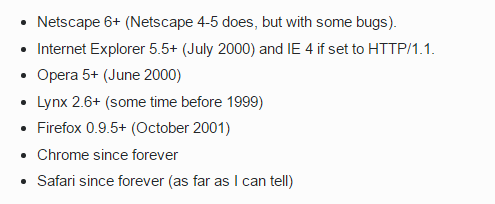
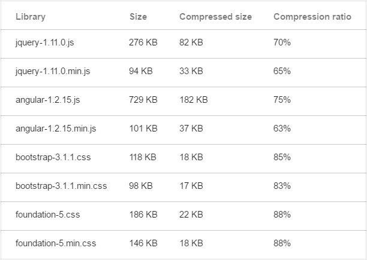
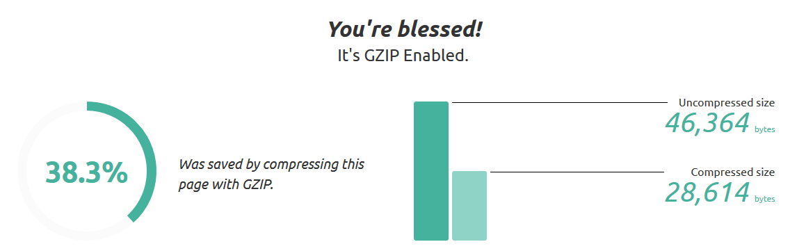
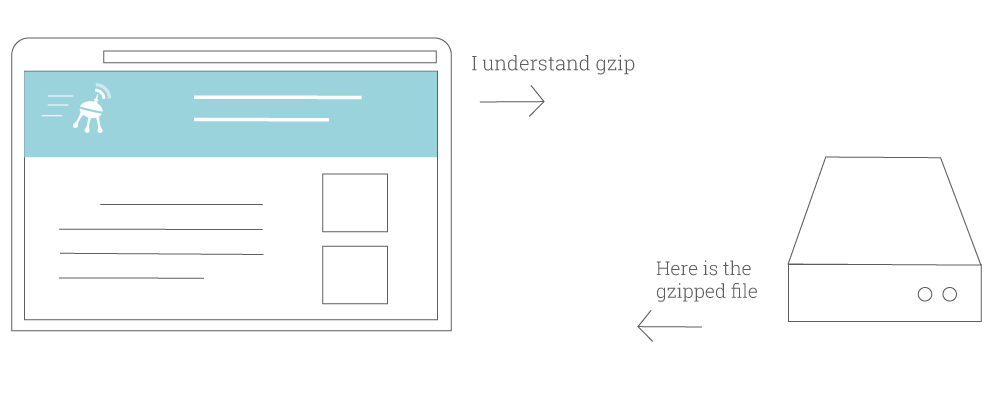
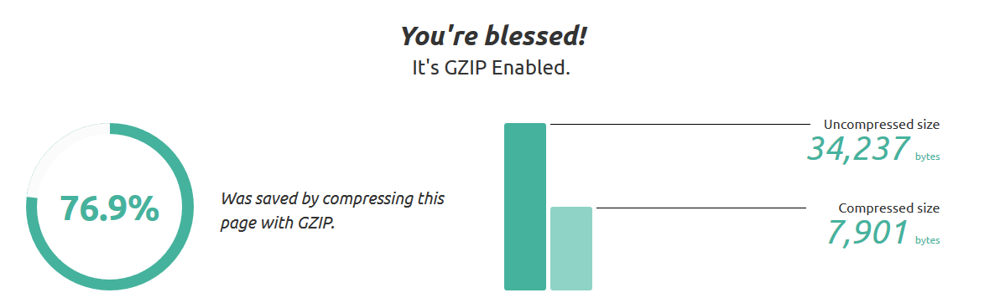

Hôm nay bất chợt tự ngồi tự sướng với [Blog](//blogk.xyz) xem chỉ số trong tab **Network** của [Chrome DevTools](https://developer.chrome.com/devtools) thấy kết quả hơi lạ file style.css chỉ có hơn 8 kb mà thực tế file đó có dung lượng tận đến ~ 36kb, tiếp tục test với [Web developer](//blogk.xyz/category/web-development/) tools trên **Firefox** thì mình đã dần hiểu ra.<!--more-->

Có 2 chỉ số mà chúng ta cần quan tâm là:
- **Size**: Dung lượng thực tế của file đó.
- **Transferred**: Là băng thông để tải file đó, nó thường nhỏ hơn hoặc bằng kích thước thực thế của file đó.

### Hỏi tại sao hả?

Thích thế đó! Đùa đấy, ban đầu mình cũng không biết tại sao, nhưng sau khi lật tung cả quả đất lên thì mình cũng tìm ra lý do. Đó chính là thằng **Gzip**!

### Gzip là gì?

Nôm na, Gzip là một phương thức để **nén và làm giảm dung lượng** các file ở server trước khi gửi đến client (ví dụ như trình duyệt). Nó giúp **tiết kiệm băng thông**, tăng tốc độ tải của website.

Nó có thể nén các file tĩnh như HTML, CSS, Javascript hay 1 số document khác như XML hay JSON, còn ảnh ọt, media các thứ thường không nén được bằng gzip mà sẽ được nén với phương thức khác và được xử lý trước khi ta tải lên server.

### Tương thích với các trình duyệt

Hầu hết các trình duyệt hiện nay đều hỗ trợ Gzip, còn nếu mà có thằng nào nào dùng trình duyệt mà không hỗ trợ Gzip thì chắc là trình duyệt đó từ thập kỉ trước rồi và kệ mọe nó đi.

### Hiệu năng

Kết quả test với 1 số thư viện phổ biến cho kết quả gzip giảm được ~70-80%.

Theo 1 số tài liệu mình tìm được Gzip được hai bác **Jean-loup Gailly** và **Mark Adler** phát triển dựa trên thuật toán **DEFLATE** - nó là kết hợp của **LZ77** và **Huffman**. Các bạn nào thích nghiên cứu sâu hơn thì tự tìm hiểu chứ thực sự thì mình cũng méo có hiểu mấy thuật toán đó mà chỉ đọc cho biết thôi :)) Nôm na thì nó vẫn dựa và xác suất nhiều nên nhiều file gzip giảm dung lượng được rất nhiều nhưng nhiều file thì cũng được rất ít nhưng vẫn tương đối hiệu quả.

Một ví dụ khác thử với file : **dashicons.min.css**

Gzip chỉ nén được khoảng 38%.

### Cơ chế hoạt động

- Bước 1: Trình duyệt gửi request tới server kèm theo tín hiệu: "Ê! Tao chấp nhận gzip nhé!" bằng cách gửi request mà trong header có chứa "**Accept-Encoding:gzip, deflate**"
- Bước 2: Server đáp: "OK!" và kèm theo file đã được nén gzip cho trình duyệt. Tương tự response trả về cũng kèm theo tín hiệu "**Content-Encoding:gzip**" để trình duyệt biết là file này đã được Gzip.

### Nhược điểm

Cái gì thì cũng có hai mặt của nó và Gzip cũng không phải ngoại lệ. Trên ta nói rất nhiều ưu điểm của nó, vậy nhược điểm đằng sau đó là gì?

#### Tương thích với trình duyệt

Như mình đã nói ở trên, hầu hết các trình duyệt hiện này đều hỗ trợ còn nếu không thì chỉ là mấy cái IE &lt; 6 từ thời La-pô-lê-ông còn chưa mặc sịp rồi và cách đơn giản để giải quyết việc này là không gửi các file gzip cho các trình duyệt đó là xong (ở dưới phần cấu hình mình có nói).

#### Không phải là tất cả

Gzip thường nén tốt với các file text như HTML, CSS, Javacript, XML, bla bla bla. Còn đối với các file media như ảnh ọt, video, audio, pdf thì ta nên nén ngay trước khi upload lên server và không bật gzip đối với các file này để tránh tốn thời gian và CPU vô ích của server.

#### Được cái lọ thì mất cái chai

Để đánh đổi cho việc tiết kiệm băng thông thì server của chúng ta phải gồng mình nên để gzip trước khi gửi file lại cho người dùng nên ta dễ dàng thấy gzip sẽ tiêu tốn 1 phần CPU của bạn nhưng mình nghĩ là không nhiều.

### Cách bật gzip

Hầu hết các **shared hosting** đều hỗ trợ gzip cả. Dể hiểu đúng không! Các đại lý hosting đều không muốn server của họ phải ngoẻo. Còn đối với server hay VPS thì bạn phải tự bật roài.

Để biết website của bạn đã bật gzip chưa bạn có thể kiểm tra tại: [checkgzipcompression.com](http://checkgzipcompression.com) hay [Google PageSpeed Insights](https://developers.google.com/speed/pagespeed/insights/).

Nếu câu trả lời là chưa thì bạn có thể làm theo hướng dẫn sau:

#### Apache

Thường các shared hosting sử dụng webserver là Apache. Nếu bạn sử dụng VPS thì hãy chắc chắn rằng <kbr>mod_deflate</kbr> được bật và nếu là shared hosting mà ko hỗ trợ thì bạn nên chuyển nhà cung cấp được rồi đó. Với Apache bạn chèn đoạn code này vào file .htaccess:

Nếu không được thì có thể sử dụng cách dưới này:

#### NGINX

Để bật gzip trên NGINX bạn chèn vào file config của domain đó:

#### Litespeed

Ờ, cái này bạn tự hỏi gu gồ nhé, mình chưa dùng **Litespeed** nên mình cũng không rõ lắm.

#### WordPress

Nếu bạn đang sử dụng WordPress thì hãy quên đống code trên đi và chỉ cần cài đặt plugin [W3 Total Cache](https://wordpress.org/plugins/w3-total-cache/) hay [WP Super Cache](https://wordpress.org/plugins/wp-super-cache/), mọi chuyện cứ để plugin lo.

### Kết luận

Túm cái váy lại thì **Gzip** là 1 thứ không thế thiếu ở thế giới Web, nói lại một lần nữa nhé: "KHÔNG THỂ THIẾU Gzip íp íp ippp......". Nó giúp ta tải web nhanh hơn, mượt mà hơn, nhờ nó mà chúng ta tiết kiệm được bao nhiêu tiền mạng rồi để tiền đó nhắn tin với gấu, quá đã :)) Gzip thật bá đạo phải không nào!