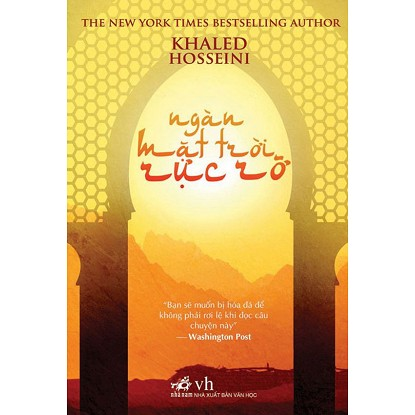

Những quốc gia Hồi giáo mang đến nhiều hiếu kì kì lạ đối với tôi. Đây là một chủ đề mà tôi chưa bao giờ nghĩ rằng sẽ là một chủ đề tôi thích cho đến khi...

Bắt đầu từ một cuốn sách mang tên Con đường Hồi giáo của Nguyễn Phương Mai, một cô gái Việt Nam nhỏ nhắn, đã bất chấp những lời khuyên răn từ bạn bè, cô đã đi, đã đến, đã cảm nhận với một trái tim mở toang, không che giấu, về những đất nước Trung Đông. Nếu như, Trung Đông trong mắt tôi trước đấy phải chăng cũng chỉ là những quốc gia Hồi giáo nhiều màu xám xịt, có khủng bố, có cực đoan, có bất bình đẳng, và chắc là có nhiều dầu mỏ. Thật nhạt nhẽo! Nhưng rồi tôi vỡ mộng, bối rối đến ngạc nhiên.

Dõi theo bước chân Nguyễn Phương Mai, một Saudi ngập trong vũng dầu và nhiều tiền đến mức có thể xây một bức tường thành toàn bằng vàng cao 1 mét quanh các quốc gia làm đường biên. Saudi ngày xưa phụ nữ làm sếp, góa bụa vẫn lấy trai tân, lại còn chủ động đòi cưới. Thế nhưng bây giờ, phụ nữ chỉ là cái tên đính kèm trên chứng minh thư của đàn ông, không được lái xe, ra ngoài không có người đàn ông đi cùng thì nghỉ khỏe. Một vụ cháy nổ xảy ra, thế nhưng các cô gái bị ngăn không cho chạy ra ngoài vì không có khăn chùm đầu, kết quả họ bị chết thảm thương. Và còn rất nhiều, rất nhiều điều “hóa ra” khiến Hồi giáo thêm phần mê hoặc và kì bí.

Bắt đầu từ một bài tập nhóm trên lớp có thuyết trình lên quan đến những người phụ nữ hồi giáo, chúng tôi cùng tìm hiểu về văn hóa, phong tục và luật lệ nơi đây. Và trong tâm tưởng luôn có những sự ngưỡng mộ và xen chút thương cảm.
Và giờ đây khi đọc Ngàn mặt trời rực rỡ, những cảm xúc hiếu kì đó lại trỗi dậy. Câu chuyện về những số phận bị vùi dập nhưng đầy ám ảnh.

Cuộc đời hai cô gái Mariam và Laila, hai người phụ nữ, hai tuổi thơ trái ngược nhau và rồi những biến cố khốc liệt của cuộc đời khiến họ phải gặp nhau. Và những đau đớn, quằn quại bắt đầu.

Maria - sinh ra đã là một lỗi lầm, người con rơi không được cha mình công nhận, sống trong những ảo tưởng được cha thương yêu thế nhưng sự thật phũ phàng là người cha không thể và không bảo vệ được cô, gả cô cho một ông chồng hơn cô cả mấy chục tuổi.
Laila - là một cô gái thượng lưu sống trong nhung lụa, được cha mẹ yêu thương, thế nhưng chiến tranh đã cướp đi cha mẹ, và khiến cô rời xa người bạn thời niên thiếu - chàng trai cô yêu thương - và là cha của đứa trẻ đang mang trong bụng khi cô 15 tuổi.
Rốt cuộc cả hai cùng trở thành vợ một người đàn ông, cố gắng sinh con cho anh ta, cùng bị đánh đập, hành hạ tàn nhẫn, đáng sợ. Trong một lần xung đột xảy ra đến đỉnh điểm..., không thể chịu được nữa, không thể để bản thân mình bị đối xử như vậy nữa - Maria đã giết chết người chồng đó - đó là lần đầu tiên cô thấy mình đã lựa chọn đúng, vì bản thân mình, vì những người mình thương yêu.

Cuối cùng, Maria bị kết án tử hình, Còn Laila phải rời đất nước ra đi với người yêu và những đứa con. Số phận họ đã hòa quyện vào nhau trong thân phận đau thương, chua xót, trái ngang nhưng bền bỉ của người phụ nữ Afganistan trước nền chính trị hỗn loạn và tôn giáo hà khắc, làm nên những giá trị  mới, những bản trường ca bất tận, những tâm hồn mang ánh sáng rực rỡ đầy yêu thương.
