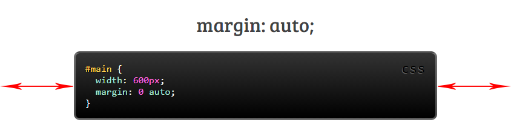
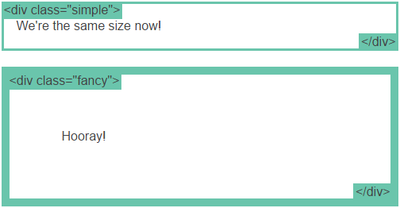

Bài này mình sẽ nói về những nguyên tắc cơ bản nhưng cực kỳ quan trọng khi thiết kế bố cục, bày trí cho 1 trang web.

### 1\. No layout

Đầu tiên là khi chưa có layout (layout mặc định), nó cũng khá ổn nêu bạn muốn một cột to để chứa nội dung. Tuy nhiên nó thực sự gây phiền nếu thực sự người dùng có 1 màn hình cực rộng, sau khi họ đọc hết dòng thì họ lại phải quay sang bên phải rất xa để tìm dòng tiếp theo để đọc.

Trước khi chúng ta giải quyết vấn đề này, chúng ta cùng tìm hiểu rõ về thuộc tính display.<!--more-->

### 2\. Display

**display** là thuộc tính cực kỳ quan trọng trong việc xây dựng bố cục. Mọi phần tử đều có một giá trị display mặc định tùy vào loại phần từ. Có 2 kiểu thông dụng và thường dùng nhất là block và inline. Một phần tử kiểu block thường được gọi là phần tử "**block-level**", còn phần tử kiểu inline thì vẫn chỉ gọi là phần tử inline.

*   **block**: thẻ div là một tiêu chuẩn cho kiểu "**block-level**". Một "block-level" được bắt đầu trên một dòng mới và nó trải dài ra cả 2 bên mà nó có thể. Các phần tử "block-level" khác như p, form hay như 1 số thẻ mới của HTML5 như header, footer, section,...
*   **inline**: thẻ span là phần tử inline tiêu chuẩn. Một phần tử kiểu inline có thể tự bẻ dòng khi hết dòng. Thẻ a cũng là một trong những thẻ thông dụng kiểu inline.
*   **none**: Một giá trị thông dụng nữa của display là none. Cái này thường được dùng trong script để ẩn hay hiện một số phần tử nào đó mà không muốn xóa hay tạo lại chúng.
Một kiểu ẩn hiện khác là visibility. Nhưng nó khác với display, ví dụ như display:none thì phần tử đó sẽ bị biến mất luôn, không gian của nó vừa chiếm sẽ được giải phóng cho các phần tử khác. Còn với visibility:hidden thì phần tử đó vẫn còn nguyên ở đó nhưng nó sẽ không xuất hiện (giống như kiểu tàng hình), điều đó có nghĩa nó là vẫn chiếm không gian ở đó mà nó đang chiếm giữ (giống như kiểu nếu thằng nào mà tàng hình thì ta vẫn có thể sờ thấy nó nhưng không thể nhìn thấy).
*   **Kiểu khác**: Có một số giá trị **display** lạ lẫm hơn như list-item hay talbe. Bạn có thể xem qua [danh sách các giá trị của display](https://developer.mozilla.org/en-US/docs/Web/CSS/display) này.
*   **Mở rộng thêm**: Như ta đã đề cập từ trước thì mọi phàn tử đều có giá trị display mặc định của nó. Tuy nhiên, chúng ta luôn luôn có thể ghi đè thuộc tính display của nó. Bạn có thể sử dụng kiểu này để tùy chỉnh kiểu display cho phần tử có nghĩa riêng biệt. Một ví dụ điển hình như là sử dùng display:inline cho thẻ li để tạo một menu ngang.

### 3\. margin: auto;

Cài đặt thuộc tính width cho một phần tử kiểu "**block-level**" sẽ ngăn chặn nó trải dài hết ra 2 bên mà nó có thể. Sau đó bạn có thể cài đặt thêm thuộc tính margin:auto để căn giữa theo chiều ngang.
Nhưng lại có 1 vấn đề xảy ra khi chiều ngang của cửa sổ trình duyệt nhỏ hơn giá trị width mà bạn đã cho. Điều này dẫn đên việc người dùng sẽ phải kéo thanh cuộn ngang sang để xem được hết nội dung. Đừng lo lắng, chúng ta sẽ giải quyết vấn đề này ở phần tiếp theo! Let's go :]]

### 4\. max-width

Sử dụng **max-width** thay vì dùng width để cải thiện cho những màn hình trình duyệt cỡ nhỏ. Điều này cực kì quan trọng khi bạn muốn tạo một **website responsive**.

Hỗ trợ: **max-width** được hỗ trợ trên tất cả các trình duyệt và IE7 trở lên.

### 5\. Mô hình khối

Trong khi chúng ta đang nói về width, chúng ta nên quan tâm đến 1 thứ nữa là 1 chiều rộng của phần tử không hề báo trước.

Nếu bạn set with cho 1 phần tử nhưng nó sẽ có thể to hơn như bạn nghĩ nếu bạn set **border** hoặc **padding** cho khối đó. Border và padding sẽ tự phủ rông ra chứ nó không chiếm phần bên trong của khối đó đã cài đặt. Bạn có thể xem ví dụ của 2 phần tử dưới đây.

Và đây là kết quả:

Bạn có thể thấy phần bên trong nội dung của box đều có chiều rộng như nhau (500px), nhưng ở box có class **fancy** thì to hơn là do có **padding** và **border** lớn hơn nên nó sẽ phình ra rộng hơn.

Vậy để 2 ô bằng nhau thì ta cần có phép tính để căn chỉnh with sao cho phù hợp. Nhưng thật may mắn ta không cần phải làm thế...

### 6\. box-sizing

Để giải quyết vấn đề trên thì thêm một thuộc tính mới ra đời: box-sizing. Khi ta đặt: box-sizing: border-box; thì trên phần tử đó, **padding** và **border** không còn làm tăng chiều rộng của phần tử đó nữa mà nó tự lấy 1 phần bên trong của phần tử đó làm không gian cho **padding** và **border**, và đương nhiên phần không gian cho nội dung của phần tử bị nhỏ lại. Bạn có thể xem ví dụ dưới đây:

Và đây là kết quả, cả 2 box có chiều dài bằng nhau mặc dù chúng có **padding** và **border** không bằng nhau:

Việc điều chỉnh như thế này là rất hay nên nhiều lập trình viên muốn tất cả các phần tử đều có thuộc tính này bằng cách sử dụng **universal selector**:

Và hãy nên sử dụng tiền tố -webkit- và -moz- để nó có thể chạy trên tất cả các trình duyệt nhé.

Bài này cũng khá dài rồi nên mình sẽ dừng lại ở đây và sẽ viết tiếp phần [tiếp theo](http://tutran.net/nhung-thuoc-tinh-quan-trong-khi-xay-dung-bo-cuc-website-p2.html).

Bài được dịch từ: **learnlayout.com**