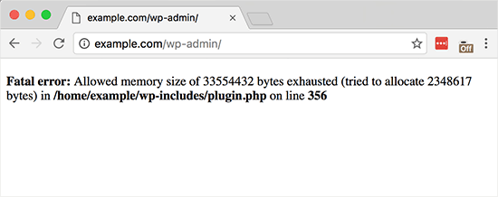

Tiện hôm nay trời mưa nên đành ngồi lại công ty chút chờ tạnh mưa chút về nên rảnh rỗi ngồi ngoáy ngoáy vài dòng cho khuây khỏa.



Anh em trong giới WordPress hẳn nhìn đoạn lỗi này sẽ thấy quen quen =))
```
Fatal error: Allowed memory size of xxxxxx bytes exhausted (tried to allocate xx bytes)
```

Thỉnh thoảng mình rất phát bực vì mấy lỗi này mà méo biết làm thế nào? Ví dụ như khi cần tải file hay đọc **file dung lượng lớn**, **giải nén file** hay một tiến trình phải xử lý rất nhiều logic chẳng hạn, một số site dở dở ương ương rất hay oẳng.
<!--more-->

Mình đã từng gặp tính huống là trong 1 tiến trình đó phải xử lý rất nhiều như: tải file, đọc file, parse file, import vào hệ thống, cập nhập dữ liệu và nó thường rất dễ oẳng. Và giải pháp của mình là **chia nhỏ tiến trình** đó ra để giảm nhẹ cho hệ thống, nghe ok đó chứ. Đấy là tách được nhỏ, giả sử chả tách được nữa thì chỉ biết kêu gào à. Không! Chúng ta không thể khuất phục thế được.

## Cớ làm sao?

Thì đấy! Tiến trình PHP đang chạy nhưng méo đủ bộ nhở nên oẳng giữa chừng (**Fatal error**) kèm theo lời than khóc mong được xin thêm tài nguyên.

**Hỏi**: Thế thì phải mua thêm RAM rồi lắp vào là được hả?
Chưa chắc nhé, yếu tố quan trọng ở đây là: các hệ thống thường có 1 thông số gọi là **memory_limit** để giới hạn memory tối đa cho mỗi tiến trình.

## Tại sao cứ limit memory làm gì cơ chứ?

**Developer**: Tại sao trời đất không dung hòa?
**Hosting provider**: Phải giới hạn chứ không các chú làm loạn à?

Các bạn biết đấy! Các site WordPress chủ yếu là dùng hosting là chủ yếu và mỗi site đó đều được **chia sẻ tài nguyên** với tất các các site khác trên cùng server đó. Vì là ngồi chung thuyền vậy nên chủ thuyền đành phải giới hạn các tài nguyên ở 1 mức nào đó để tránh trường hợp 1 thanh niên nào đó ngáo đá dùng hết luôn tài nguyên của hệ thống và dẫn đến sập cả hệ thống.

Và **memory** cũng vậy, mỗi tiến trình PHP chạy sẽ tạo cần 1 số lượng bộ nhớ nhất định và các hosting provider đã cài đặt 1 giới hạn trung bình mà để các tiến trình bình thường vẫn đủ bộ nhớ để chạy.

## Giải pháp là gì?

Đơn giản là tăng `memory_limit` lên là được? Đơn giản như đan rổ :))

Ồ không đơn giản thế đâu, nếu bạn là WordPress developer thì biết mỗi site mỗi kiểu, mỗi site 1 loại hosting khác nhau. Nhưng ở đây mình sẽ đưa ra các trường hợp và giải pháp để khắc phục (không được không lấy tiền).

### Bạn dùng server riêng

Ồ đơn giản rồi.

*   Tìm file config php.ini trong hệ thống (tìm file php.ini bằng cách gõ lệnh `php --ini` hoặc tạo 1 file php đơn giản với gọi hàm `phpinfo()` rồi xem thông tin trong đó có).
*   Sau đó tìm đến dòng **memory_limit** rồi tăng chỉ số đó lên.

### Bạn đang dùng hosting dởm

Trường hợp này phổ biến nhất, bạn có thể tìm trên mạng có hàng đống [hướng dẫn](https://goo.gl/ZhsNdF) kiểu này.
Nếu mà không được thì vứt mọe nó hosting đi dùng thằng khác nhé!

## Đấng cứu thế cho developer

Phần hay ho nhất nằm ở đây.

Là một **WordPress developer** chắc hẳn có lúc bạn sẽ gặp những pha xử lý cần rất nhiều memory của hệ thống mà memory bị giới hạn và nó cứ oẳng mà không biết kêu ai. Thì lúc đó thì phải tự thân vận động thôi, không thể chờ bọn admin của mấy cái site kia tăng memory lên được. Lạy trời!


Thật may **WordPress Core** đã hiển linh, từ phiên bản 4.6 trở đi, WordPress cung cấp 1 function hay vãi cả đái luôn.

```
wp_raise_memory_limit($context)
```

Nhiệm vụ của nó là tăng ngay **memory_limit** tại thời điểm đang thực thi. **$context** là bối cảnh mà bạn gọi nó ra. Bạn cũng có thể tạo riêng context riêng rồi đặt `memory_limit` lên to chà bá cũng được (à nhưng vừa vừa thôi nhé không to quá méo tăng được đâu). Bạn muốn biết hàm đó nó làm gì trong đó thì cứ mở ra mà xem nhé.

Vậy nên khi nào mình dự đoán 1 tiến trình nào đó cần tốn memory thì cứ phang hàm này vào nhé :))

Thân ái và quyết thắng!