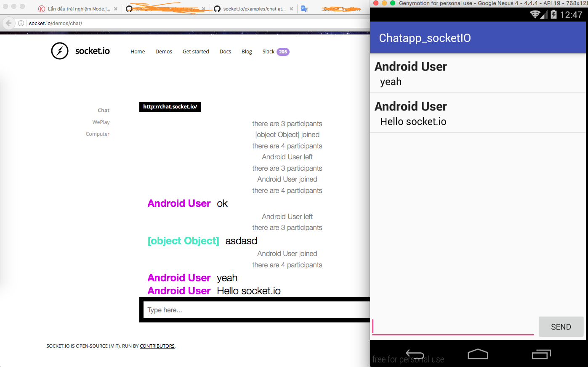

Xin chào 500 anh em!
Hôm nay mình sẽ giới thiệu cho các bạn một cái nhìn bao quát nhất và dễ hình dung nhất về thư viện **Socket.IO** trên Android. Mong rằng sau khi đọc bài viết các bạn có thể tự tay xây dựng nên một ứng dụng realtime nho nhỏ hoặc sẽ nảy ra những ý tưởng hay ho với thư viện này.


Let's go!
<!--more-->

## Socket.IO là gì?

**Socket.IO** là một bộ thư viện dành cho các ứng dụng web, mobile realtime. Với đặc trưng mạnh mẽ và dễ sử dụng, **Socket.IO** đang dần trở nên quen thuộc với các nhà phát triển (Từ Microsoft Office, Yammer, Zendesk, Trello... tới những đội hackathon, những start up trẻ).

### Thư viện này gồm 2 phần:

*   **Phía client**: gồm bộ thư viện viết cho web(JavaScript), iOS, Android
*   **Phía server**: viết bằng JavaScript và dùng cho các máy chủ node.JS

## Socket.IO làm gì?

**Socket.IO** cung cấp cho các nhà phát triển một cách đơn giản và thuận tiện để xây dựng một ứng dụng realtime đa nền tảng (web và mobile). Với bộ thư viện này, làm việc với socket trở nên đơn giản hơn rất nhiều.

### Demo với ứng dụng Android cơ bản

Thư viện Socket.IO trên Android cung cấp những **hàm cơ bản** sau:

*   **connect()**: kết nối với server socket
*   **on(event_name, listener)**: đăng kí lắng nghe sự kiện từ server trả về
*   **emit(event_name, data)**: gửi một sự kiện lên server
*   **off(event_name)**: ngừng lắng nghe một sự kiện nào đó

Với ví dụ này, mình sẽ sử dụng server cho sẵn của trang Socket.IO để tạo một ứng dụng chat realtime. Bạn có thể dùng thử phiên bản web ở đây: [http://socket.io/demos/chat/](http://socket.io/demos/chat/).

**Chức năng chính: **

*   Đăng nhập*   Nhận tin nhắn từ phòng chat*   Gửi tin nhắn tới phòng chat

**Cài đặt thư viện liên quan:**
Ta dùng Gradle để quản lí những thư viện có trong project
Thêm dependency vào build.gradle:

*   appcompat-v7 (lấy theme cho ảo ảo tí)
*   socket.io (thiếu thì vứt đi nhé =)) )

```
// app/build.gradle
dependencies {
    ....
    compile 'com.android.support:appcompat-v7:23.4.0'
    compile 'com.github.nkzawa:socket.io-client:0.3.0'
}
```

Làm xong bước này các bạn phải rebuild project để chắc chắn rằng Android Studio đã giúp ta tải source liên quan đến project về máy.

Thêm quyền truy cập internet vào AndroidManifest.xml

```
<!-- app/AndroidManifest.xml -->
    ...
    <uses-permission android:name="android.permission.INTERNET" />
    ...
</manifest>
```

Tiếp theo, ta sẽ xây dựng một giao diện chat đơn giản gồm một listview chứa tin nhắn và một form nhập tin nhắn.

Tạo một layout **"activity_main.xml"** với nội dung như sau:

```
<?xml version="1.0" encoding="utf-8"?>
<LinearLayout xmlns:android="http://schemas.android.com/apk/res/android"
    android:layout_width="match_parent"
    android:layout_height="match_parent"
    android:orientation="vertical">

    <ListView
        android:id="@+id/lv_chat"
        android:layout_width="match_parent"
        android:layout_height="0dp"
        android:layout_weight="1" />

    <TableRow
        android:layout_width="match_parent"
        android:layout_height="wrap_content"
        android:gravity="center">

        <EditText
            android:id="@+id/edt_input"
            android:layout_width="0dp"
            android:layout_height="wrap_content"
            android:layout_weight="1" />

        <Button
            android:id="@+id/btn_send"
            android:layout_width="wrap_content"
            android:layout_height="wrap_content"
            android:text="Send" />
    </TableRow>

</LinearLayout>
```

Tạo một layout **"item_chat.xml"** với nội dung như sau:

```
<?xml version="1.0" encoding="utf-8"?>
<LinearLayout xmlns:android="http://schemas.android.com/apk/res/android"
    android:layout_width="match_parent"
    android:layout_height="wrap_content"
    android:padding="8dp"
    android:orientation="vertical">

    <TextView
        android:layout_width="wrap_content"
        android:layout_height="wrap_content"
        android:textAppearance="?android:attr/textAppearanceLarge"
        android:text="Username"
        android:textStyle="bold"
        android:id="@+id/tv_username" />

    <TextView
        android:layout_marginLeft="10dp"
        android:layout_marginRight="10dp"
        android:layout_width="wrap_content"
        android:layout_height="wrap_content"
        android:textAppearance="?android:attr/textAppearanceMedium"
        android:textColor="@android:color/black"
        android:text="Hello Socket.io"
        android:id="@+id/tv_message" />
</LinearLayout>
```

Tạo một lớp **ItemChat** gồm thuộc tính username, message, các phương thức get, set tương ứng như sau:

```
public class ItemChat {

    private String username;
    private String message;

    public ItemChat(String username, String message) {
        this.username = username;
        this.message = message;
    }

    public String getUsername() {
        return username;
    }

    public void setUsername(String username) {
        this.username = username;
    }

    public String getMessage() {
        return message;
    }

    public void setMessage(String message) {
        this.message = message;
    }
}
```

Tạo một **Adapter** cho Listview để gắn dữ liệu vào nó:

```
import android.content.Context;
import android.view.LayoutInflater;
import android.view.View;
import android.view.ViewGroup;
import android.widget.BaseAdapter;
import android.widget.TextView;

import java.util.ArrayList;

import too.fries.com.chatapp_socketio.R;
import too.fries.com.chatapp_socketio.ItemChat;

public class ChatAdapter extends BaseAdapter {

    private Context mContext;
    private LayoutInflater mInflater;
    private ArrayList<ItemChat> itemChatArr;

    public ChatAdapter(Context context){
        this.mContext = context;
        this.mInflater = LayoutInflater.from(context);
        itemChatArr = new ArrayList<>();
    }

    public void addNewMsg(ItemChat itemChat){
        this.itemChatArr.add(itemChat);
    }

    @Override
    public int getCount() {
        return itemChatArr.size();
    }

    @Override
    public Object getItem(int position) {
        return itemChatArr.get(position);
    }

    @Override
    public long getItemId(int position) {
        return position;
    }

    @Override
    public View getView(int position, View convertView, ViewGroup parent) {
        if (convertView == null){
            convertView = mInflater.inflate(R.layout.item_chat, null);
        }

        TextView tvUsername = (TextView) convertView.findViewById(R.id.tv_username);
        TextView tvMessage = (TextView) convertView.findViewById(R.id.tv_message);

        tvUsername.setText(itemChatArr.get(position).getUsername());
        tvMessage.setText(itemChatArr.get(position).getMessage());
        return convertView;
    }
}
```

Bước chuẩn bị view đã xong, bây giờ ta sẽ thực hiện bước kết nối và truyền nhận dữ liệu bằng socket.io

Tại **MainActivity.java** ta khởi tạo một đối tượng socket có nhiệm vụ truyền nhận dữ liệu với server

```
import com.github.nkzawa.socketio.client.IO;
import com.github.nkzawa.socketio.client.Socket;

private Socket mSocket;
{
    try {
        mSocket = IO.socket("http://chat.socket.io");
    } catch (URISyntaxException e) {}
}
```

IO.socket() trả về một đối tượng socket mặc định giao tiếp với "http://chat.socket.io". Kết quả trả về từ phương thức này được lưu cache nên bạn có thể gọi nó mặc định ở các Activity hoặc Fragment khác (với cùng đối tượng socket với url tương ứng).

```
@Override
public void onCreate(Bundle savedInstanceState) {
    super.onCreate(savedInstanceState);
    mSocket.connect();
}

@Override
public void onDestroy() {
    super.onDestroy();
    mSocket.disconnect();
}
```

Sau đó ta gọi hàm connect() để thực hiện kết nối. Việc kết nối nên được gọi đầu tiên lúc ứng dụng được bật lên và không liên quan tới vòng đời của các component Android (Activity, Fragment, Service). Tuy nhiên để ví dụ này đơn giản nhất, mình sẽ gắn nó với vòng đời của activity (gọi hàm connect() tại onCreate(), disconnect() tại onDestroy()).

### Listening on events

Để hứng event từ server trả về, ta sẽ đăng kí sự kiện với tên của event đó tương ứng

```
@Override
public void onCreate(Bundle savedInstanceState) {
    super.onCreate(savedInstanceState);

    mSocket.on("new message", onNewMessage);
    mSocket.connect();
}

@Override
public void onDestroy() {
    super.onDestroy();

    mSocket.disconnect();
    mSocket.off("new message", onNewMessage);
}
```

với **"new message"** là tên của sự kiện, **onNewMessage** là một đối tượng xử lí dữ liệu khi được gọi về, khi activity bị ẩn hoàn toàn ta gọi mSocket.off() để tắt lắng nghe sự kiện

```
import com.github.nkzawa.emitter.Emitter;

Emitter.Listener onNewMessage = new Emitter.Listener() {
    @Override
    public void call(final Object... args) {
        MainActivity.this.runOnUiThread(new Runnable() {
            @Override
            public void run() {
                try {
                    JSONObject jsonObject = new JSONObject(args[0].toString());
                    String username = jsonObject.getString("username");
                    String message = jsonObject.getString("message");

                    ItemChat itemChat = new ItemChat(username, message);
                    mAdapter.addNewMsg(itemChat);
                    mAdapter.notifyDataSetChanged();
                } catch (JSONException e) {
                    e.printStackTrace();
                }
            }
        });
    }
};
```

Với mỗi listener được tạo ra ta phải cài đè phương thức call() tương ứng. Bởi vì hàm gọi lại (callback) này có thể được gọi từ bất kì luồng (thread) nào của chương trình nên để chắc chắn nhất ta phải để nó trong luồng chính để việc cập nhật UI không bị lỗi.

### Emitting events

Socket.IO hoạt động 2 chiều (truyền, nhận dữ liệu). Điều đó có nghĩa ta có thể vừa nhận dữ liệu từ server vừa có thể gửi thông điệp tới server bất kì lúc nào. Ở đây, sau khi kết nối thành công ta sẽ gửi một thông điệp để đăng kí với server tên, để mỗi lần gửi tin nhắn tới server có thể biết tên ta là gì. Nó giống với thủ tục check in khi vào một nơi nào đó vậy.

```
private static final String USERNAME = "Android User";
@Override
protected void onCreate(Bundle savedInstanceState) {
    super.onCreate(savedInstanceState);
    setContentView(R.layout.activity_main);

    initViews();

    mSocket.on("new message", onNewMessage);
    mSocket.connect();

    mSocket.emit("add user", USERNAME);
}
```

Câu lệnh **emit(event_name, data)** có tham số truyền vào là:

*   **event_name**: Tên sự kiện gửi đi (String)
*   **data**: Thông điệp gửi đi (có thể là một String hoặc một JSON object)

Sau cùng, ta sẽ khởi tạo các view và thêm sự kiện gửi tin nhắn tương ứng khi người dùng nhấn nút send

```
private Button btnSend;
private EditText edtMsg;
private ListView lvChat;
private ChatAdapter mAdapter;

private void initViews() {
    lvChat = (ListView) findViewById(R.id.lv_chat);
    btnSend = (Button) findViewById(R.id.btn_send);
    edtMsg = (EditText) findViewById(R.id.edt_input);
    mAdapter = new ChatAdapter(this);

    lvChat.setAdapter(mAdapter);

    btnSend.setOnClickListener(new View.OnClickListener() {
        @Override
        public void onClick(View v) {
            if (!edtMsg.getText().toString().isEmpty()){
                String msg = edtMsg.getText().toString();
                mSocket.emit("new message", msg);
                edtMsg.setText("");

                ItemChat itemChat = new ItemChat(USERNAME, msg);
                mAdapter.addNewMsg(itemChat);
                mAdapter.notifyDataSetChanged();
            }
        }
    });
}
```

-> chạy thử và xem kết quả nào :D



Các bạn thấy đấy, với **Socket.IO**, việc giao tiếp với server socket thật đơn giản phải không nào. Ta không cần bận tâm đến những câu cú phức tạp và điều khiển luồng thông tin thật rắc rối của socket - điều rất dễ xảy ra lỗi với những chương trình có nhiều sự kiện đến và đi. Việc ta làm ở đây chỉ đơn giản là **kết nối -> đăng kí lắng nghe sự kiện -> gửi sự kiện**, mọi rắc rối hãy để socket.IO lo :D

Mã nguồn đầy đủ của project: [https://github.com/minhnt58/ChatApp_Socket.io](https://github.com/minhnt58/ChatApp_Socket.io)
Bài viết có tham khảo: [http://socket.io/blog/native-socket-io-and-android/](http://socket.io/blog/native-socket-io-and-android/)