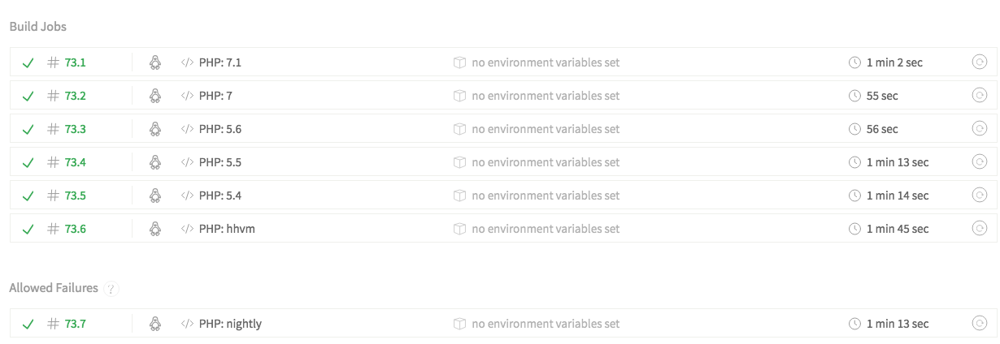
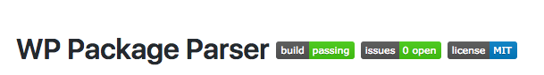

Dạo này vẫn cày cuốc mấy sản phẩm bên WordPress. Hôm nọ dự án cần một thư viện để parse các file zip được đóng gói là các theme và plugin bên **WordPress**. Tay nhanh hơn não liền hỏi bác Gồ ngay :))

Quả trời không phụ lòng người thương cho những người ngu như mình, mình vớ ngay được một repository trên Github được viết cách đây 4 năm. Cũng thử nghiệm chạy thử cũng thấy ok nhưng không vừa ý lắm nên mình đã quyết định lôi nó về và cải tiến nó rồi lại tung lên Github cho mọi người cùng dùng.<!--more-->

## Bài toán là?

Đầu vào là các file zip đóng gói là theme hoặc plugin của WordPress và đầu ra là thông tin của plugin hay theme đó (mình gọi là metadata). Chỉ vậy thôi và tất nhiên nó được viết bằng PHP rồi.

## Giải quyết

Đơn giản như ăn bánh, mình bắt tay vào viết và sau khoảng 5h hì hục mình cũng viết xong. Cụ thể thuật toán hay logic thế nào thì mình không nói rõ ở đây vì cũng chả có gì để bàn ở đây lắm. Để chuyên nghiệp hơn tí mình tìm hiểu thêm chút về Unit test  trong PHP. Nói thật là từ trước đến nay mình ít khi viết test lắm :)) Với PHP thì có ngay thằng PHPUnit - nó là 1 framewrok bá đạo trong thế giới **unit testing của PHP**.

Cách dùng PHPUnit thì các bạn có thể tìm hiểu trên mạng nhé :)) Ở bài này mình chủ yếu sẽ nói về **quá trình mình viết 1 thư viện cho PHP**.

Ngồi lúc viết 1 đống test xong, thấy cũng xịt vài cái rồi lại hì hục sửa để pass hết đống test đấy. Kể ra cũng hay viết test xong cảm giác yên tâm vãi luôn. Kiểu từ trước giờ toàn chân tay bo viết chẳng biết đúng sai ra sao, nhiều lúc toàn gặp phải mấy bug không nên có. Viết test mới đầu có vẻ khổ nhưng sau thì sướng vô cùng :))

Khổ lỗi mỗi lần viết xong lại phải chạy lệnh để test mà gõ lệnh dài bực mình liền viêt thêm cái task rồi nhét vào [gulp](http://blogk.xyz/su-dung-gulp-de-viet-sass-hieu-qua/) cho nó chạy cho đỡ mệt.

Để nâng cấp độ nguy hiểm thêm tí nữa mình tích hợp thêm thằng Travis vào nữa. Nó cho phép mình tạo ra 1 sanbox rồi test với đủ loại môi trường. Ví dụ test với các phiên bản PHP version từ 5.x đến 7.x hay cả HHVM. Travis nó không chỉ support cho PHP đâu nhé mà cả các ngôn ngữ khác, bạn nào muốn tìm hiểu chi tiết thì có thể tìm hiểu trên [docs của Travis](https://docs.travis-ci.com/).

Mỗi lần commit 1 travis sẽ tự động build và test cho bạn. Nếu gặp lỗi nó sẽ thông báo cho bạn biết luôn để bạn biết mà fix.

Đấy test ok với Travis rồi thì nhét thêm mấy icon như này vào Readme nhìn nó chuyên nghiệp hẳn phải không nào :D

## PHP có Composer phải không nào?

PHP thì bạn hẳn quen với Composer để quản lý các package cũng như sự phụ thuộc của các package. Nó cũng tương tự như npm ở Node hay gem ở Ruby.

Dể support Composer thì mình cần phải cấu hình trong phần `autoload` của **Composer** để khi cài đặt package qua composer thì composer sẽ đọc file composer.json và require package theo cấu hình autoload đó. Ở package này của mình dùng kiểu autoload đơn sơ giản dị nhất là liệt kê file ra để require =)) Và cấu hình composer và sẵn sàng cho các developer cài đặt và dùng.

## Kết quả

Kết quả là đã viết xong 1 thư viện PHP và open source tại Github: [https://github.com/tutv95/wp-package-parser](https://github.com/tutv95/wp-package-parser) và hỗ trợ cho các dự án dùng Composer thông qua câu lệnh để cài đặt: `composer require tutv95/wp-package-parser`. Các bạn thấy hay thì cài đặt dùng thử hoặc share cho bạn bè nhé :))

**Để tạo 1 thư viện PHP** thì có 1 số việc cần thiết phải làm:
- Viết test đầy đủ
- Chạy test trên nhiều môi trường với sự hỗ trợ của các Service CI như Travis chả hạn
- Hõ trợ trình quản lý các thư viện như PHP là Composer.
- Viết documentation đầy đủ, rõ ràng.
- Rồi sau đó xem có ai cài đặt và sử dụng không đã.
- Rồi nếu nó có nhiều người quan tâm thì có thể sinh ra issue thì cũng phải giải quyết và nếu có lỗi thì cập nhật mã nguồn.

Tada! Hết rồi :))