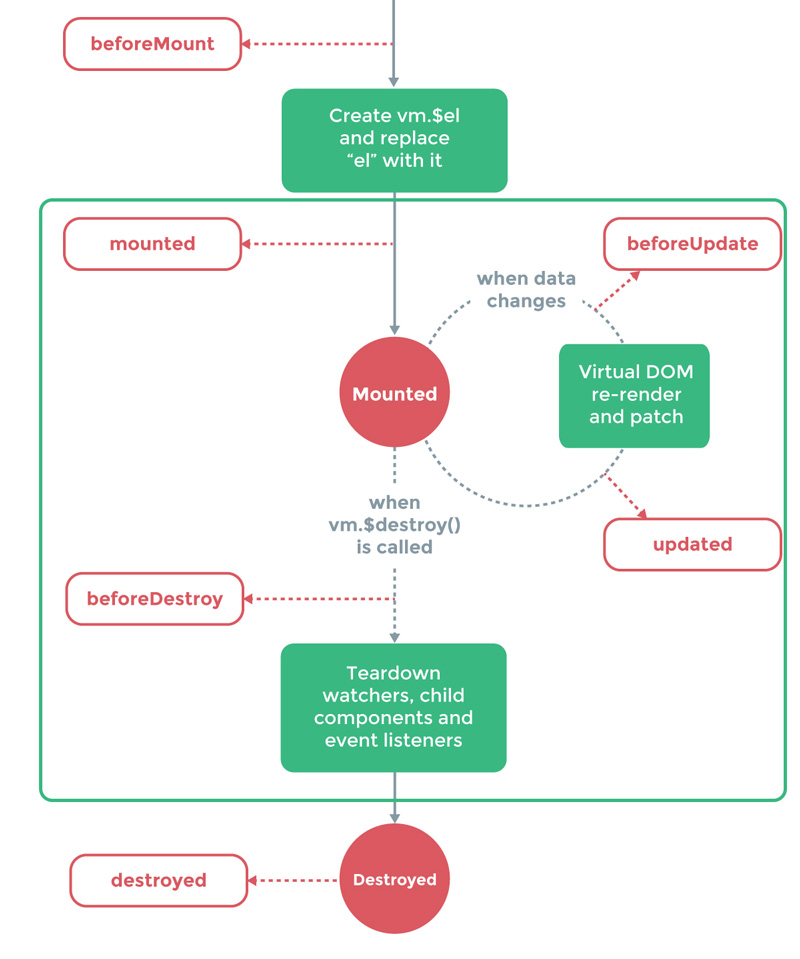

title: Cách sử dụng jQuery plugins trong VueJS
catalog: true
tags:
  - vuejs
  - javascript
  - frontend
categories:
  - Frontend
date: 2017-08-28 17:17:01
subtitle:
header-img: ../media/vue-jquery.jpg
author: Max
---
Hế lô! Sau 1 thời gian tu luyện trên núi mình đã quyết định xuống núi để quay lại chiến đấu cùng các ae. Hôm nay mình xin giới thiệu đến các bạn 1 thứ hoàn toàn mới và khá hay ho mang tên "*Viu gi ét*" :))

Nếu bạn là một dev **front-end** chân chính thì chắc hẳn ít nhất một lần đã nghe và có thể là đang làm với framework này rồi nhỉ.
Mình cũng vậy, sau khi bị nó thả thính và bắt đầu mê nó nên mình đã quyết định áp dụng dùng thử nó với 1 plugin của **WordPress**.

Trước đây mình cũng đã từng dev **AngularJS**, rồi Angular 2+ và cũng suýt tẩu hỏa nhập ma với nó. Vì vậy mình đã xách mông lên tìm một môn võ mới mang tên **VueJS**.
Sau 1 thời gian dev với VueJS thì mình đã phải thốt lên "Sao mày không đến với cuộc đời tao sớm hơn :))" bởi vì nó quá tuyệt vời và phù hợp với những nhu cầu của mình.

Và để bắt đầu với **seri lầy lội cùng VueJS** mình xin giới thiệu 1 trick khá hay mà VueJS có thể làm được đó là:

**Cách sử dụng các plugins của Jquery trong ứng dụng VueJS một cách mượt mà.**

## Source code:

Các bạn có thể xem qua source code và demo tại đây.

<script async src="//jsfiddle.net/tutv95/f717xdm7/19/embed/js,html,result/"></script>

## Vấn đề

Hẳn là khi các bạn làm với các project áp dụng mấy framework kiểu như VueJS này thì một số thư viện cũng chưa hỗ trợ mà vẫn phải dùng thêm các **plugins của jQuery** đúng không nào?

Bình thường thì nếu bạn làm với ứng dụng Web kiểu **Server-Side Rendering** thì phần html đã được render ra khi người dùng load trang và chỉ cần áp dụng vài dòng code Javascript với Jquery là chạy ngay. Nhưng với các framework như VueJS thì cấu trúc DOM không được load ngay từ đầu nên ta không thể chạy các plugin của **jQuery** theo cách thông thường.

Ở đây mình xin demo 1 trường hợp sự dụng **plugin select2 của Jquery để chạy trong ứng dụng VueJS.**

## Giải pháp

Ta sẽ tạo ra 1 component và wrap nó lại.
```
<script type="text/x-template" id="template-select2">
    <select class="vue-select2">
        <option v-for="option in options"
        :value="option.key"
        :selected="option.key=== selected">{{option.value}}</option>
    </select>
</script>

<script>
Vue.component('vue-select2', {
        template: '#template-select2',
        props: ['options', 'selected']
});
</script>
```

Component này sẽ có 2 **props** là `options` là list options để select và `selected` nếu muốn set 1 option nào đã được select.

Để làm được ta cần phải tìm hiểu 1 chút về life cycle của VueJS nhé.



Như các bạn thấy trong ảnh thì đến đoạn `mounted` là thời điểm mà Vue render html và replace vào cấu trúc DOM và đây chính là cơ hội để mình có thể chạy plugin `select2`. Và thời điểm thứ 2 ta cần quan tâm là lúc component chuẩn bị xóa đi khỏi DOM đó là `beforeDestroy` - đây là thời điểm tốt để các bạn xóa tất cả các sự kiện trên component đó đồng thời hủy `select2` chạy trên component đó.

```
Vue.component('vue-select2', {
        template: '#template-select2',
        props: ['options', 'selected'],
        model: {
            prop: 'selected',
            event: 'change'
        },
        mounted: function() {           
            $(this.$el).select2();
        },
        beforeDestroy: function() {
            $(this.$el).off().select2('destroy');
        }
    });
```

Xong rồi đó, component đã có thể chạy được ngay. Nhưng vẫn còn một vấn đề nữa đó là bạn cần phải cập nhật sự thay đổi lên **parent component** chứ nhỉ. Để làm được điều đó ta bắt sự kiện `change` của `select` đó rồi dùng `$emit` để đẩy sự kiện cho thằng cha.

```
 mounted: function() {
        	var vm = this;
           
			$(this.$el).select2();
            $(this.$el).on('change', function(e) {
            	vm.$emit('change', vm.$el.value);
            });
        },
```
Sau đó ở thằng cha bắt sự kiện `@change` để cập nhập trạng thái option đã được select (trong demo mình dùng tính kiểu **two-way binding** để chuyền ngược lại cho thằng cha luôn).

Xong rồi đó, ở demo trên kia thì mình có thêm 1 số tính năng nữa để demo khi thằng cha thêm option hoặc thay đổi `option` đang được select thì thằng con cũng cập nhật được trạng thái của nó.

## Kết luận
Mình xin tổng kết lại nhé. Ở đây chỉ có 2 bước quan trọng là:

1. Chọn thời điểm **component được thêm vào DOM** để chạy plugin của Jquery và thời điểm để hủy các sự kiện khi **component đó bị hủy đi**.

2. Tìm **sự kiện thay đổi trạng thái** của component con để cập nhật lên compnent cha để biết sự thay đổi.

Quá đơn giản phải không nào. Mình cũng bắt đầu thích VueJS vì **sự tương thích của nó với các plugin của jQuery** vì jQuery nó đã quá to rồi và hệ sinh thái của nó quá lớn nên thời gian này mình vẫn còn phụ thuộc vào nó rất nhiều trong khi các thư viện hỗ trợ cho VueJS còn chưa nhiều. Nói chung là tuyệt cmn vời :))

